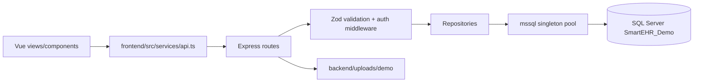

# SmartEHR database and backend performance audit

**Audit scope:** repository state inspected on 2026-10-09. This is a synthetic local demo, not a live HIS schema (see `README.md`). No schema, application, credential, or production setting was changed by this audit.

## Executive summary

The implementation is small and reasonably modular: Vue views call a typed API wrapper, Express routes validate with Zod, repositories use parameterized `mssql` queries, and SQL migrations define the demo schema. Backend typecheck, build, and the two existing tests pass.

The highest-priority findings are correctness/security risks rather than proven SQL bottlenecks:

1. **Critical — authorization is not consistently object-scoped.** `GET /api/patients/:patientId`, `GET /api/admissions/:admissionId`, and code-chart access endpoints authenticate a caller but do not verify that the caller is allowed to access that specific patient/admission. `ensureDocumentAccess` grants access from the global role and does not use the persisted per-admission access table. This is acceptable only for synthetic demo mode; it is not safe for clinical data.
2. **Critical — upload attribution is client-controlled.** `POST /api/documents` accepts `uploadedBy` from the request and records activity only as a role. The uploader must come from the authenticated principal, with immutable audit identity stored server-side.
3. **High — patient search performs an admission join, aggregation, and a second equivalent aggregation for every request.** `backend/src/modules/patients/repository.ts:listPatients` derives `patientType` from free-text `Ward`/`Status`, then repeats the CTE for `COUNT(*)`. This is confirmed from code; impact needs an actual SQL Server plan and measurements.
4. **High — detail endpoints defeat pagination.** `GET /api/patients/:patientId` calls `listAdmissions`, which returns every admission; `GET /api/admissions/:admissionId` calls `listDocuments`, which returns every document. The frontend then uses these full collections. This is confirmed.
5. **High — document upload is inefficient and unsafe at scale.** The browser base64-encodes the entire file, sends it in JSON, and Express accepts an 8 MB JSON body. The server writes the file before inserting metadata and has no compensating cleanup if the insert fails. This is confirmed.

No query-plan, Query Store, logical-read, CPU, duration, concurrency, or production-volume measurements were available. Performance severity above is therefore code-based risk, not measured production impact.

## 1. Current architecture and request flow

### Existing module boundaries

- `backend/src/server.ts`: Express composition, Helmet, permissive CORS, JSON body limit, auth middleware, routers, static demo uploads, error handler.
- `backend/src/modules/patients`: patient list/detail and patient admission routes/repository.
- `backend/src/modules/admissions`: admission detail, code-chart access, demo account access, activity repository.
- `backend/src/modules/medical-records`: document list/detail/file/upload routes and repository.
- `backend/src/modules/auth`: username/password login, DB-backed sessions, logout.
- `backend/src/database/connection.ts`: singleton `mssql/msnodesqlv8` pool promise plus separate `openPool` helper.
- `frontend/src/services/api.ts`: one fetch wrapper and endpoint methods.
- `frontend/src/views`: page-local loading, pagination, and error state. `frontend/src/stores/demo.ts` only stores demo role.

Important flows:

- Patient list: `PatientsView.vue` debounces search for 300 ms -> `api.patients` -> `GET /api/patients` -> `listPatients` (paged rows plus separate count result set).
- Patient details: `PatientDetailsView.vue` -> `api.patient` -> `GET /api/patients/:id` -> `getPatient` + **unpaged** `listAdmissions`; it separately calls `patientAdmissions`, but the template renders `patient.admissions`, so the paginated result is not the displayed data.
- Admission details: `AdmissionView.vue` -> `api.admission` -> `GET /api/admissions/:id` -> `getAdmission` + **unpaged** `listDocuments`; it also calls paged `api.documents`, causing redundant document retrieval and a second network/database path.
- Upload: `UploadDocumentDialog.vue` reads the entire file to base64 -> JSON POST -> route writes a local file -> repository inserts metadata -> activity insert.

## 2. Existing database model

| Entity | Responsibility and relationships | Constraints/indexes observed |
|---|---|---|
| `Patient` | One patient identity/demographic row; parent of `Admission` | PK `PatientId`, unique `PatientNumber`, required names/DOB/sex, sex check |
| `Admission` | Encounter/admission attached to one patient | PK, FKs to `Patient`, unique admission and encounter numbers, `(PatientId, AdmissionDate DESC)` index, status check |
| `MedicalDocument` | Metadata for a document attached to one admission; file path is external | PK, FK to `Admission`, `(AdmissionId, DocumentDate DESC)`, status check |
| `DemoAccount` | Synthetic selectable account/role | PK, unique display name, role check |
| `CodeChartUserAccess` | Per-admission/per-demo-account permission | PK, FKs, unique `(AdmissionId, DemoAccountId)`, permission/reason checks |
| `CodeChartRoleAccess` | Earlier role-level access model retained by migrations | Unique `(AdmissionId, ClinicalRole)`; migration 010 deletes its rows but leaves the table |
| `CodeChartAccessActivity` | Admission activity by role | PK, `(AdmissionId, CreatedAt DESC)`; does not retain user ID/account ID |
| `AppUser` | Authentication principal | PK, unique username, Argon2 hash field, role and enabled checks |
| `AuthSession` | Hashed bearer-in-cookie session | PK, unique token hash, user FK, expiry/user indexes |

The design is approximately 3NF for the demo’s core entities. It has no duplicate patient/admission/document identity table, but the authorization model has overlapping role-level and account-level tables and the activity table stores role rather than the actual actor.

## 3. Findings

### Critical findings

**C1 — Object-level patient/admission authorization is missing (confirmed).**

Affected files/functions: `backend/src/modules/patients/routes.ts`, `backend/src/modules/admissions/routes.ts`, `backend/src/modules/medical-records/routes.ts:ensureDocumentAccess`.

Routes call `requireAuthenticated`, but no service checks an authenticated user’s relationship to the requested patient/admission. Document access is determined by global `ADMIN`, `AUDITOR`, or `RECORDS_VIEWER`, not `CodeChartUserAccess`; `getCodeChartPermission` exists but is not used by the document authorization path. The frontend role/store is not a security boundary.

Impact: unauthorized disclosure or modification if real records are connected. Recommended fix: introduce one server-side authorization policy that resolves user, role, patient/admission scope, action, and expiry; apply it to every read, file stream, upload, and access-management endpoint. Add deny-by-default integration tests for cross-patient and expired access.

**C2 — Audit attribution and upload identity are client-controlled (confirmed).**

`POST /api/documents` accepts `uploadedBy`; the UI sends the literal `Records Staff`. Activity records only `ClinicalRole`. Replace with authenticated `UserId`/account identity selected by the server. Preserve historical attribution; do not overwrite existing records without a migration plan.

**C3 — File and metadata write are not atomic (confirmed).**

`medical-records/routes.ts` writes the generated file, then `createDocument` inserts metadata, then activity is written. Failures can leave orphaned files or metadata without a file. Use an upload staging/quarantine flow, metadata transaction, and cleanup/outbox reconciliation. This is a design change requiring approval because it affects storage lifecycle.

### High findings

**H1 — Patient list aggregation is repeated and non-SARGable (confirmed from SQL; unmeasured).**

`patients/repository.ts:listPatients` uses `LIKE '%term%'` on patient number, first name, and last name; joins all admissions; groups all patient columns; computes type from `UPPER(Ward) LIKE '%ER%'` and `UPPER(Status)`. The count repeats the CTE. The derived type is a presentation heuristic, not a stable clinical attribute. Measure with actual execution plans and `SET STATISTICS IO, TIME ON`.

Recommended sequence: first remove duplicated work with a single count strategy or separate lightweight count query; add deterministic tie-breakers already partly present; then decide, based on measured search requirements, between prefix search, full-text search, or a normalized encounter/status model. Do not add broad indexes before measuring.

**H2 — Unpaged detail data and redundant API calls (confirmed).**

`patients/routes.ts` returns `admissions: await listAdmissions(patientId)` while `PatientDetailsView.vue` also loads `patientAdmissions`. `admissions/routes.ts` returns `documents: await listDocuments(admissionId)` while `AdmissionView.vue` loads `api.documents`. Change detail responses to summary-only, use the existing paged endpoints for lists, and render the paged state. This reduces response size and SQL work as history grows.

**H3 — Admission/document list aggregations may scan more than needed (confirmed query shape; unmeasured).**

`listAdmissions` and `listAdmissionsPage` left join documents and `GROUP BY` every admission column to count documents. Prefer pre-aggregated counts with a grouped derived table or `OUTER APPLY` only after checking plans; ensure the count uses the intended status scope. Existing indexes support the join, but document count behavior needs validation at volume.

**H4 — Upload payload and limits are mismatched (confirmed).**

The client base64 expansion increases payload size by roughly one third, and the route permits a base64 string of 8,000,000 characters inside an 8 MB JSON body. Validate decoded byte length, MIME/type/content signature, filename policy, and rate/timeout limits. Prefer multipart streaming to approved object/file storage for production. Do not expose `/uploads/demo` as a clinical storage pattern.

### Medium findings

**M1 — Session lookup performs a read then a write on every authenticated request (confirmed).**

`demoAuth.ts` calls `findSession`; `auth/repository.ts` updates `LastSeenAt` every time. This adds write load and contention. Throttle last-seen updates (for example, only after a configured interval), keeping absolute and idle expiry semantics explicit. Add concurrency tests.

**M2 — Access update/revoke operations lack explicit transactions and actor fields (confirmed).**

`setCodeChartAccess` and `revokeCodeChartAccess` combine permission mutation and activity insert in one batch but without an explicit transaction/error contract. Use a transaction with concurrency-safe upsert semantics and actor ID. Add a unique-key race test.

**M3 — Error responses may expose internal messages (confirmed).**

`shared/http.ts:errorHandler` returns `error.message` for every status, while unexpected errors are logged with the full error object. Use stable public messages, correlation IDs, and structured logs with patient/user/document identifiers omitted or tokenized. Never log request bodies or patient content.

**M4 — CORS is permissive (confirmed).**

`server.ts` uses `cors({ origin: true, credentials: false })`. For cookie authentication, configure an explicit trusted origin list and `credentials: true`, plus CSRF protection appropriate to deployment. This is demo-friendly but not production-safe.

**M5 — Frontend search cancellation is missing (confirmed).**

`PatientsView.vue` debounces but does not abort or sequence requests; stale responses can overwrite newer results. `AdmissionView.vue` triggers document loading on input without debounce/cancellation. Add `AbortController` support in `api.ts`, request sequence guards, and 250–300 ms document-search debounce.

**M6 — Client-side auth/demo state can diverge from server auth (confirmed).**

`demo.ts` determines `canUpload` from local storage, while server authorization is separate. Treat it as display-only; derive capabilities from `/auth/me` and handle 401/403 centrally.

### Low findings

- `CodeChartRoleAccess` appears superseded by `CodeChartUserAccess` but remains in the schema. Retain until usage/data lineage is proven; then deprecate through a planned migration, not deletion.
- `MedicalDocument.DocumentName` was added nullable but is not selected or written by repositories. Either document it as legacy or complete a deliberate naming decision.
- `openPool` and migration/bootstrap code should have explicit lifecycle ownership; the request path correctly uses a singleton promise pool.
- Existing tests cover only demo-role behavior. No repository, route, authorization-scope, migration, or frontend-fetch tests exist.

## 4. Proposed database direction (approval required)

Do not apply these changes yet. They are recommendations for a production-capable schema evolution.

1. **Identity and actor attribution:** retain `Patient`, `Admission`, and `MedicalDocument`; add an immutable actor reference to clinical audit/activity rows (`UserId` or a general `ActorId`) with FK where appropriate. Keep display-name snapshots only if required for historical reporting.
2. **Authorization:** choose one authoritative access model. For per-user access, retain `CodeChartUserAccess`, add indexes for `(AdmissionId, DemoAccountId, ExpiresAt)` and `(DemoAccountId, AdmissionId, ExpiresAt)`, and define how an `AppUser` maps to an account. Retire role-level access only after a data/use audit.
3. **Clinical history:** avoid physical cascades from patient/admission/document. Use status/retention workflows and restricted archival. Existing FKs do not specify cascade, which is the safer default.
4. **Document storage:** keep metadata in SQL Server, but store content in managed storage with an opaque key, checksum, size, MIME, upload state, and retention/deletion status. If SQL storage is required, evaluate `varbinary(max)`/FILESTREAM separately; do not mix local filesystem paths with live clinical records.
5. **Time and validation:** continue UTC `datetime2(3)` for instants; add checks such as discharge not before admission, and status/date consistency, after profiling existing data. Decide whether `Ward` is free text or a reference entity based on integration needs.
6. **Stable encounter semantics:** `EncounterNumber` should remain unique and generated by an approved sequence/integration rule; migration 004’s demo numbering is not a production identity strategy.

Migration requirements: preflight duplicate/null checks, additive migration first, backfill in batches, dual-write/read verification, rollback plan, and an isolated backup/restore rehearsal. No destructive rename/drop is recommended in this audit.

## 5. Index recommendations and query support

These are candidates, not commands. Validate with actual plans, selectivity, write volume, and Query Store.

| Candidate | Supports | Caveat |
|---|---|---|
| `Patient(LastName, FirstName, PatientId)` including `PatientNumber, DateOfBirth, Sex` | Name-ordered patient pages after search strategy is changed to prefix/equality | Current leading-wildcard search will not use it efficiently |
| `Patient(DateOfBirth, PatientId)` | DOB range filters | Add only if filter frequency/selectivity justifies it |
| `Admission(PatientId, AdmissionDate DESC, AdmissionId DESC)` including status/ward/encounter | Patient admission pages and deterministic order | Existing index is close; verify need before replacing/adding |
| `MedicalDocument(AdmissionId, DocumentDate DESC, UploadedAt DESC, DocumentId DESC)` including type/file/uploader/status | Paged admission document list | Existing index is close; wider covering index increases writes/storage |
| `CodeChartUserAccess(DemoAccountId, AdmissionId, ExpiresAt)` | User/admission authorization lookup | Required only after authoritative access path is chosen |
| `CodeChartAccessActivity(AdmissionId, CreatedAt DESC)` including action/actor | Admission audit timeline | Existing index exists; add actor only with schema change |

For text search, prefer full-text search only when requirements justify its operational cost; otherwise use a normalized prefix search contract. Avoid indexes on every filter and avoid indexing derived `patientType` until it is modeled as stable data.

## 6. API and frontend strategy

- Make list endpoints the only source for collections: detail endpoints return entity plus small summary counts, not unbounded child arrays.
- Enforce maximum page size server-side (already present at 100; consider endpoint-specific caps) and use keyset pagination for deep, frequently accessed histories. `OFFSET/FETCH` is acceptable for shallow demo pages.
- Return a consistent envelope with `items`, `pageInfo`, and stable sort keys. Include `total` only where the UI needs it; counts can be expensive.
- Add `AbortSignal` to `api.request`, abort on unmount/route change, and ignore stale sequence numbers.
- Debounce both patient and document search; reset page when filters change; preserve server-side filters.
- Keep patient/admission/document data local to the view unless multiple routes genuinely share it. Pinia should hold authenticated user/session state and narrowly shared reference data, not every response.
- After upload, update the document list from the mutation response or invalidate only the affected admission-document query; do not reload admission, patient, and access data unnecessarily.

## 7. Prioritized implementation plan

### Phase 0 — approval and instrumentation

Obtain approval for authorization/storage/schema changes. Enable SQL Server Query Store in the isolated environment, capture representative synthetic volumes, and record baseline duration, CPU, logical reads, row counts, and response sizes.

### Phase 1 — safe application changes

Use paged patient admissions/documents in the UI; remove duplicate child payloads from detail routes; add request cancellation/debouncing; replace client `uploadedBy` with server actor; sanitize public errors; configure explicit CORS. These are incremental but require regression tests.

### Phase 2 — authorization and audit correctness

Implement one policy service and object-scoped checks for every route/file. Add actor IDs, transactionally record access changes, and test expired/revoked/cross-scope access. This is the highest clinical-safety work and requires explicit approval.

### Phase 3 — measured SQL optimization

Capture plans for patient search, admission pages, document pages, and auth lookup. Remove repeated aggregation, optimize search based on measured requirements, and add only validated indexes. Compare before/after with identical synthetic data.

### Phase 4 — document lifecycle and schema evolution

Choose storage architecture, add additive metadata/state fields, migrate in batches, reconcile orphan files, and run rollback rehearsal. Only then consider deprecating legacy role-access tables.

## 8. Verification plan

Backend tests: route validation, 401/403/404 behavior, object-scope authorization, expired access, upload size/type/content validation, actor attribution, transaction rollback, idempotent/retried upload, session expiry, and concurrent access upserts.

Database tests: migration from a clean DB and representative prior DB, FK/unique/check constraints, discharge/admission date rules, orphan detection, rollback rehearsal, and query-plan snapshots where stable.

Performance benchmarks: synthetic patient/admission/document datasets at 10k/100k/1m scales; record p50/p95/p99 latency, CPU, logical reads, duration, rows returned, payload bytes, pool wait time, and concurrent error rate. Use `SET STATISTICS IO, TIME ON`, actual execution plans, and Query Store. Do not use real patient data.

Frontend tests: one request per route load, no duplicate detail/list fetch, stale-search protection, abort on unmount, mutation invalidation, and rendered pagination state. Browser network traces should verify response sizes and request counts.

## 9. Existing verification run

Executed from `backend` on 2026-10-09:

- `npm run typecheck` — passed.
- `npm test` — passed: 2 tests.
- `npm run build` — passed.

No SQL Server integration test or live query-plan measurement was run. The working tree already contained user changes before this audit; they were preserved.
